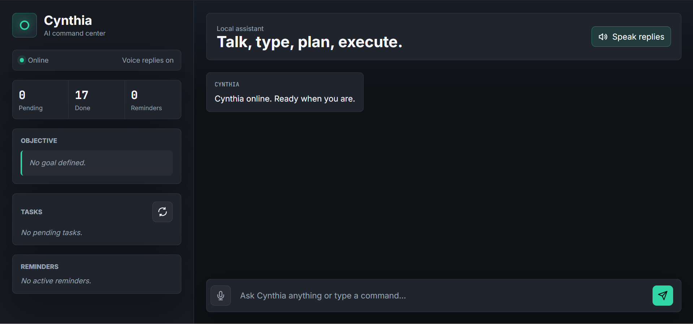

# 🚀 Cynthia AI Assistant

Cynthia is a locally-running AI assistant built with Python, Ollama, and local Large Language Models (LLMs).

The goal of this project is to create a personal AI assistant capable of voice interaction, task management, reminders, desktop automation, memory persistence, and intelligent conversations — all while running completely on local hardware without requiring paid API services.

> ⚠️ Cynthia is currently under active development. New features and improvements are being added regularly.

---

## ✨ Features

### 🎤 Voice & Text Interaction

* Speech-to-Text (STT)
* Text-to-Speech (TTS)
* Natural conversational interface
* Keyboard input support

### 🤖 AI Conversations

* Powered by local LLMs through Ollama
* Answers questions
* Explains concepts
* Assists with productivity and learning

### ✅ Task Management

* Add tasks
* View pending tasks
* Complete tasks
* Delete tasks

### ⏰ Reminder System

* Schedule reminders
* Background reminder monitoring
* Voice notifications

### 🖥 Desktop Automation

* Open installed applications
* Execute system actions
* Workflow assistance

### 🧠 Persistent Memory

* Save user goals
* Recall previous information
* Personalized responses

### 🌐 Web Interface

* Modern browser-based UI
* Real-time chat experience
* Localhost deployment

---

# 📸 Preview

## Cynthia Web Interface


---

# 🎥 Demo Video

Click the image below to watch the demonstration.


https://github.com/user-attachments/assets/14cf903f-8740-4bc1-9855-82f1d21d89b6


### Demonstrated Features

* Adding tasks
* Completing tasks
* Opening desktop applications
* AI-powered question answering
* Local LLM integration

---

# 🏗 Project Structure

```text
Cynthia/
├── app.py
├── main.py
├── requirements.txt
├── setup.py
│
├── core/
│   ├── assistant.py
│   ├── voice.py
│   └── __init__.py
│
├── modules/
│   ├── task_manager.py
│   ├── scheduler.py
│   ├── system_actions.py
│   ├── memory.py
│   └── __init__.py
│
├── utils/
│   ├── helpers.py
│   ├── logger.py
│   └── __init__.py
│
├── templates/
│   └── index.html
│
├── static/
│   ├── app.js
│   └── index.css
│
├── data/
│   ├── tasks.json
│   ├── reminders.json
│   ├── memory.json
│   └── Cynthia.log
│
├── screenshots/
│   └── cynthia-ui.png
│
└── demo/
    └── cynthia-demo.mp4
```

---

# ⚙️ Tech Stack

### Backend

* Python
* Flask

### AI

* Ollama
* Phi-3
* Local LLM Integration

### Voice

* SpeechRecognition
* PyAudio
* pyttsx3

### Frontend

* HTML
* CSS
* JavaScript

### Storage

* JSON-based persistence

---

# 🚀 Installation

## 1. Clone Repository

```bash
git clone https://github.com/tusharghuse/cynthia-ai-assistant.git
cd cynthia-ai-assistant
```

## 2. Create Virtual Environment

```bash
python -m venv .venv
```

Activate:

### Windows

```bash
.venv\Scripts\activate
```

### Linux / macOS

```bash
source .venv/bin/activate
```

## 3. Install Dependencies

```bash
pip install -r requirements.txt
```

## 4. Install Ollama

Download:

https://ollama.com

Pull a model:

```bash
ollama pull phi3
```

Verify:

```bash
ollama list
```

---

# ▶️ Running Cynthia

Start Ollama:

```bash
ollama serve
```

Run the application:

```bash
python app.py
```

Open:

```text
http://localhost:5000
```

---

# Example Commands

```text
add task Build portfolio website

show tasks

done task 1

delete task 1

remind me at 5 PM to drink water

open calculator

my goal is become a full stack developer

what is my goal

schedule my day
```

---

# 🔒 Privacy

Cynthia runs completely on your local machine.

* No cloud processing
* No paid APIs required
* User data remains local
* Offline-capable AI interactions

---

# 📈 Future Improvements

* Better memory system
* Multi-agent architecture
* File understanding
* Document summarization
* Smarter desktop automation
* Improved voice synthesis
* RAG-based knowledge retrieval
* Mobile companion app

---

# 👨‍💻 Developer

**Tushar Ghuse**

First-Year Engineering Student | Developer | AI Enthusiast

GitHub:
https://github.com/tusharghuse

---

# ⭐ Support

If you found this project useful, consider starring the repository.

It helps support future development of Cynthia.
